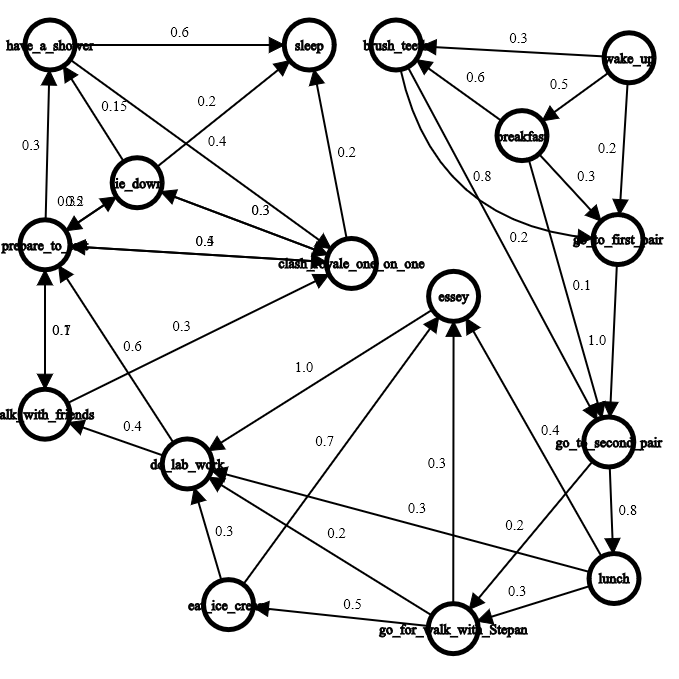

# Finite-state_machine
It's the finite-state machine that represent one of my days  
  
## The list of states:
sleep  
wake up  
breakfast  
brush teeth  
go to first pair  
go to second pair  
lunch  
go for walk with Stepan Fedyniak  
essey  
eat ice cream  
do lab work  
talk with friends  
prepare to test  
clash royale one on one  
lie down  
have a shower  
# Some examples
### 1
I am sleeping  
New day!  
I am eating breakfast in the Trapezna  
I am brushing my teeth  
I am going to the first pair  
I am going to the second pair  
I am eating lunch in the Trapezna  
I am doing lab work  
I am preparing to test  
I am playing clash royale one on one with friend  
I am preparing to test  
I am playing clash royale one on one with friend  
I am preparing to test  
I am playing clash royale one on one with friend  
I am preparing to test  
I am playing clash royale one on one with friend  
I am preparing to test  
I am playing clash royale one on one with friend  
I am preparing to test  
I am talking with friends  
I am playing clash royale one on one with friend  
I am preparing to test  
Water, hehe, bul bul bul  
I am sleeping  
### 2
I am sleeping  
New day!  
I am going to the first pair  
I am going to the second pair  
I am eating lunch in the Trapezna  
I am writing an essey  
I am doing lab work  
I am preparing to test  
I am playing clash royale one on one with friend  
I am sleeping  